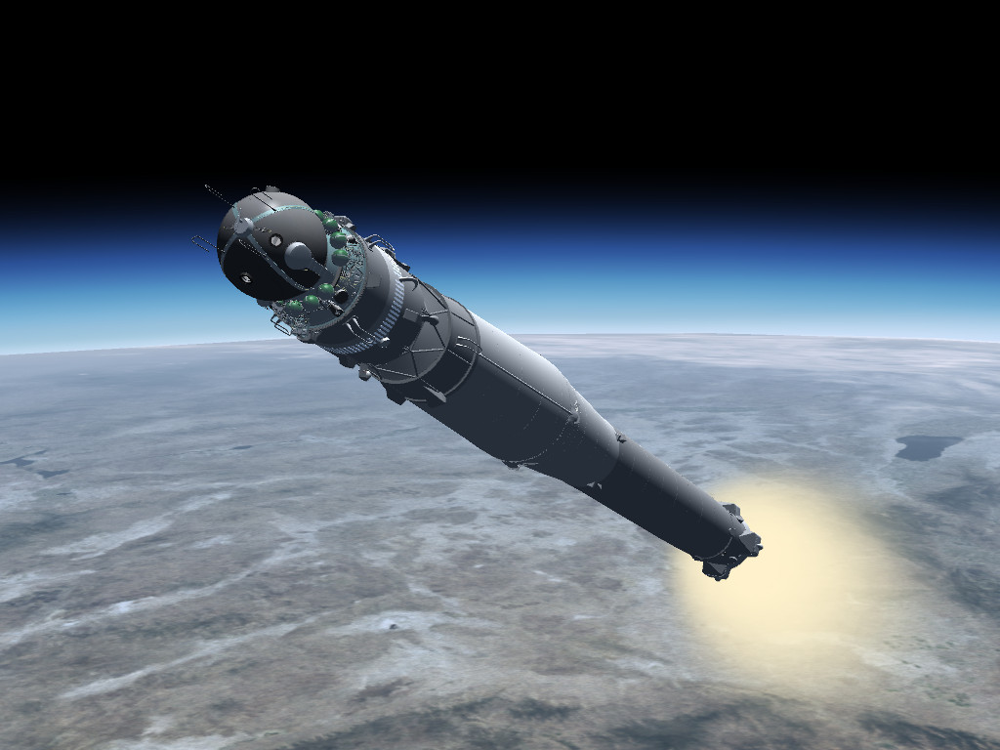
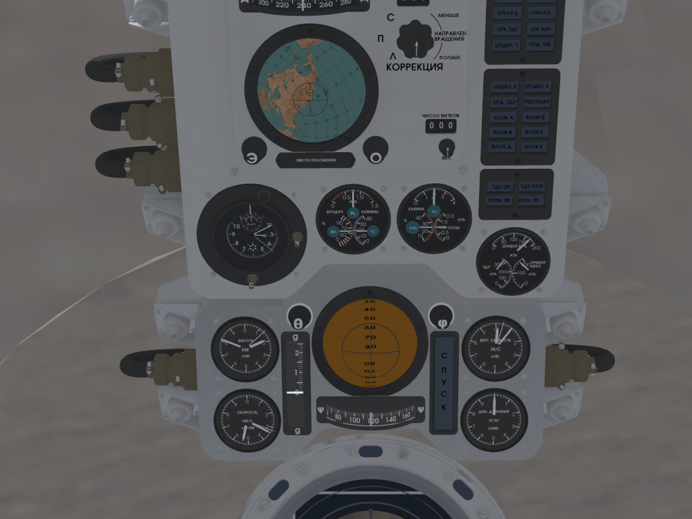

A Vostok-1 model for FlightGear that fixes some bugs (such as sound effects in newer versions), removes the workaround for older versions of the simulator that do not support altitudes above 150 km (and raises the default orbital altitude), improves realism (fairing separation), and updates the documentation.

## Installation

See [Howto:Install_aircraft#Git_repository](https://wiki.flightgear.org/Howto:Install_aircraft#Git_repository) on FlightGear Wiki for instructions.
